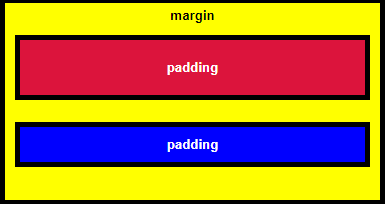

# (🔥) Basic CSS

- [x] Introduction to Basic CSS
- [x] Change the Color of Text
- [x] Use CSS Selectors to Style Elements
- [x] Use a CSS Class to Style an Element
- [x] Style Multiple Elements with a CSS Class
- [x] Change the Font Size of an Element
- [x] Set the Font Family of an Element
- [x] Import a Google Font
- [x] Specify How Fonts Should Degrade
- [x] Size Your Images
- [x] Add Borders Around Your Elements
- [x] Add Rounded Corners with border-radius
- [x] Make Circular Images with a border-radius
- [x] Give a Background Color to a div Element
- [x] Set the id of an Element
- [x] Use an id Attribute to Style an Element
- [x] Adjust the Padding of an Element
- [x] Adjust the Margin of an Element
- [x] Add a Negative Margin to an Element
- [x] Add Different Padding to Each Side of an Element
- [x] Add Different Margins to Each Side of an Element
- [x] Use Clockwise Notation to Specify the Padding of an Element
- [x] Use Clockwise Notation to Specify the Margin of an Element
- [x] Use Attribute Selectors to Style Elements
- [x] Understand Absolute versus Relative Units
- [x] Style the HTML Body Element
- [x] Inherit Styles from the Body Element
- [x] Prioritize One Style Over Another
- [x] Override Styles in Subsequent CSS
- [x] Override Class Declarations by Styling ID Attributes
- [x] Override Class Declarations with Inline Styles
- [x] Override All Other Styles by using Important
- [x] Use Hex Code for Specific Colors
- [x] Use Hex Code to Mix Colors
- [x] Use Abbreviated Hex Code
- [x] Use RGB values to Color Elements
- [x] Use RGB to Mix Colors
- [x] Use CSS Variables to change several elements at once
- [x] Create a custom CSS Variable
- [x] Use a custom CSS Variable
- [x] Attach a Fallback value to a CSS Variable
- [x] Improve Compatibility with Browser Fallbacks
- [x] Inherit CSS Variables
- [x] Change a variable for a specific area
- [x] Use a media query to change a variable

---

### Propriedades de elementos:

- Três propriedades importantes controlar o espaço que rodeia cada elemento HTML: `padding`, `margin`, e `border`.
- Um elemento `padding` controla a quantidade de espaço entre o conteúdo do elemento e o seu border.
- Um elemento `margin` controla a quantidade de espaço entre um elemento `border`e os elementos circundantes.



- Seletor de atributos exemplos:

```
[type='radio'] {
  margin: 20px 0px 20px 0px;
}
```

- Pixels `px` são um tipo de unidade de comprimento, que é o que informa ao navegador como dimensionar ou espaçar um item. 
- Os dois principais tipos de unidades de comprimento são absolutos e relativos.
- As unidades absolutas estão vinculadas às unidades físicas de comprimento. Por exemplo, `in` e `mm` consulte polegadas e milímetros, respectivamente.
- Unidades relativas, como `em` ou `rem`, são relativas a outro valor de comprimento. Por exemplo, `em` é baseado no tamanho da fonte de um elemento.


- Em muitas situações, você usará bibliotecas CSS. Eles podem substituir acidentalmente seu próprio CSS. Portanto, quando você absolutamente precisa ter certeza de que um elemento possui CSS específico, pode usar `!important`

---

### Cores Hexadecimal

    - Normal:

|Cor      |Código Hex |
|---------|-----------|
|Azul     |#1E90FF    |
|Verde    |#00FF00    |
|Laranja  |#FFA500    |
|Vermelho |#FF0000    |

    - Reduzido:

|Cor      |Código Hex |
|---------|-----------|
|Ciano    |#0FF       |
|Verde    |#0F0       |
|Vermelho |#F00       |
|Fúcsia   |#F0F       |

---

### Valores RGB

- Se você fizer as contas, os dois dígitos de uma cor são iguais a 16 vezes 16, o que nos dá 256 valores totais. Portanto RGB, que começa a contar do zero, tem exatamente o mesmo número de valores possíveis que o código hexadecimal.

- O valor RGB para preto é assim: `rgb(0, 0, 0)`

- O valor RGB para branco é assim: `rgb(255, 255, 255)`

|Cor      |RGB                |
|---------|-------------------|
|Azul     |rgb(0, 0, 255)     |
|Vermelho |rgb(255, 0, 0)     |
|Orquídea |rgb(218, 112, 214) |
|Sienna   |rgb(160, 82, 45)   |

```
rgba significa:
  r = vermelho
  g = verde
  b = azul
  a = alfa / nível de opacidade
```

---

### Variável CSS personalizada

Para criar uma variável CSS, você só precisa dar um nome a ela com dois hífens na frente e atribuir um valor como este:

```
--penguin-skin: gray;

background: var(--penguin-skin, black);
```

---

### Root

- Para fazer uso da herança, as variáveis ​​CSS são frequentemente definidas no elemento : `root`.

- `:root`é um seletor de pseudo-classe que corresponde ao elemento raiz do documento, geralmente o htmlelemento Ao criar suas variáveis `:root`, elas estarão disponíveis globalmente e podem ser acessadas de qualquer outro seletor na folha de estilos.

